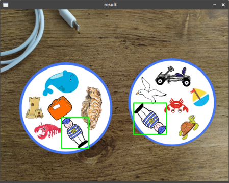
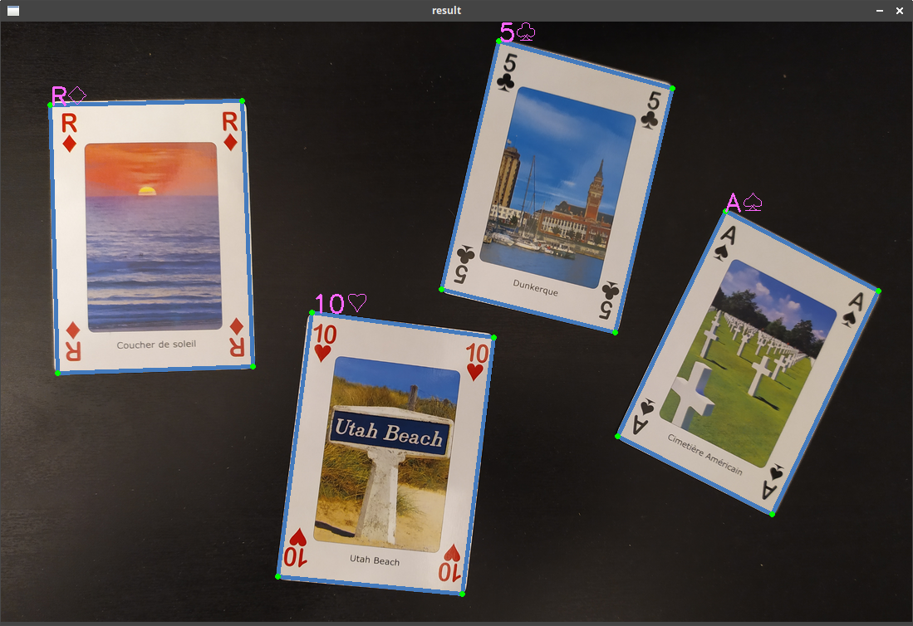
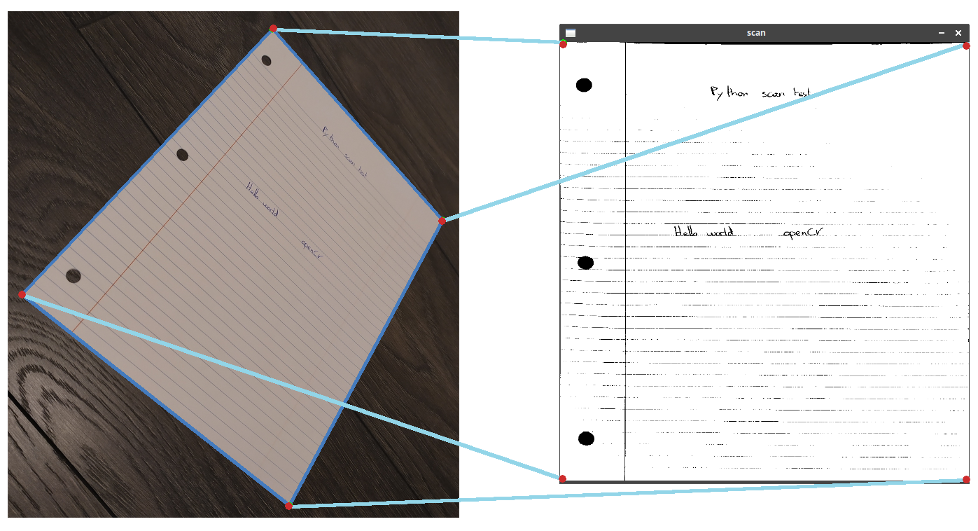

# My OpenCV projects
[](https://opensource.org/licenses/mit)
[](https://img.shields.io/badge/openCV-%3E%3D%204.2-green)  
A repository of my opencv projects

## The projects

| Project | Description | Preview |
--- | --- |:---:|
[moveTracking](moveTracking) | A program to track movement using openCV (only CPU) and send notifications via Telegram | 
[double game](doublegame) | A program to find the common element on the double's game | 
[digit recognition](digit_recognition) | A program to recognize handwritten number digit | 
[playing cards recognition](card_recognition) | A script to recognize playing cards | 
[scanner](scanner) | A script to make a scanner like render | 

## OpenCV configuration

I compiled OpenCV 4.2 from source with the `opencv_contrib` and `NONFREE algorithms`, so to have the same configuration as me, follow these commands:

```sh
mkdir opencv_src && cd opencv_src
git clone https://github.com/opencv/opencv.git
git clone https://github.com/opencv/opencv_contrib.git
mkdir build && cd build
cmake -D CMAKE_BUILD_TYPE=RELEASE \
      -D CMAKE_INSTALL_PREFIX=/usr/local \
      -D OPENCV_GENERATE_PKGCONFIG=ON \
      -D OPENCV_ENABLE_NONFREE=ON \
      -D OPENCV_EXTRA_MODULES_PATH=~/opencv_src/opencv_contrib/modules ../opencv
# find out number of CPU cores in your machine
nproc # return 12 for me
make -j12
sudo make install
pkg-config --modversion opencv4
python3 -c "import cv2; print(cv2.__version__)"
```