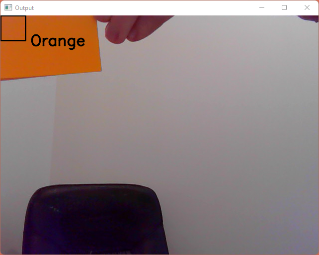

# Color recognition
[](https://opensource.org/licenses/mit)
[](https://img.shields.io/badge/openCV-%3E%3D%204.2-green)  
A program to detect common colors

## How to use

Test the detection:
```sh
python3 color.py
```

## How it works

<div style="display: flex; flex-direction: row; width:100%; height: 20px">
    <div style="flex: 1; background: red;"></div>
    <div style="flex: 1; background: orange;"></div>
    <div style="flex: 1; background: yellow;"></div>
    <div style="flex: 1; background: lightgreen;"></div>
    <div style="flex: 1; background: lightblue;"></div>
    <div style="flex: 1; background: pink;"></div>
</div>

* Create a set of detectable Hsv color range
* Extract a detection area on the camera (top left corner)
* Compute the average Hsv color of this area
* Check if the Hsv color is in detectable Hsv color range

