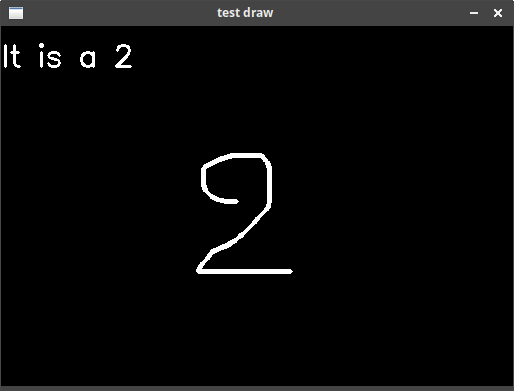
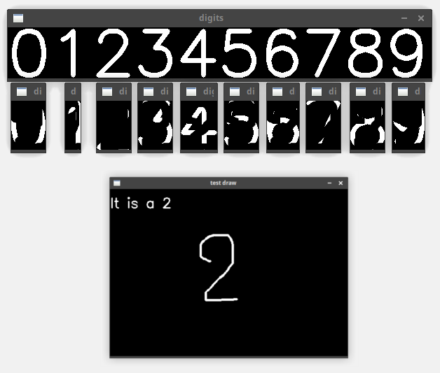

# Double game 
[](https://opensource.org/licenses/mit)
[](https://img.shields.io/badge/openCV-%3E%3D%204.2-green)  
A program to recognize handwritten number digit

## How to use

Test the detection:
```sh
python3 digit.py
```
The draw interface comes from this [StackOverflow question](https://stackoverflow.com/questions/28340950/opencv-how-to-draw-continously-with-a-mouse)  
Draw a number and you will obtain something like this:  


## How it works

* Generate the digits set
* Find contour to get separated digit
* Draw a number
* Dilate the drawed number
* Make a ROI of the drawed dilated number
* Apply `digit_img AND (scaled_roi XOR digit_img)`
* The match is given by the highest percent loss of white pixel

