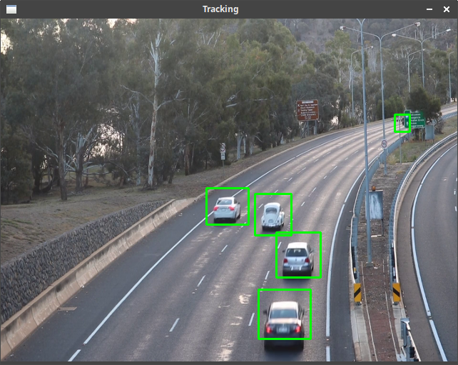
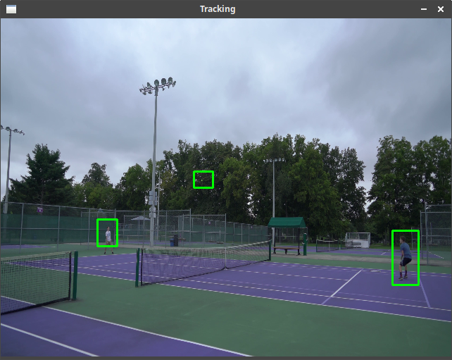
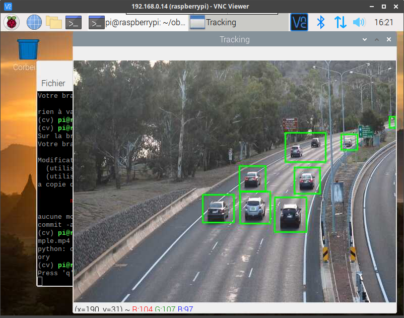
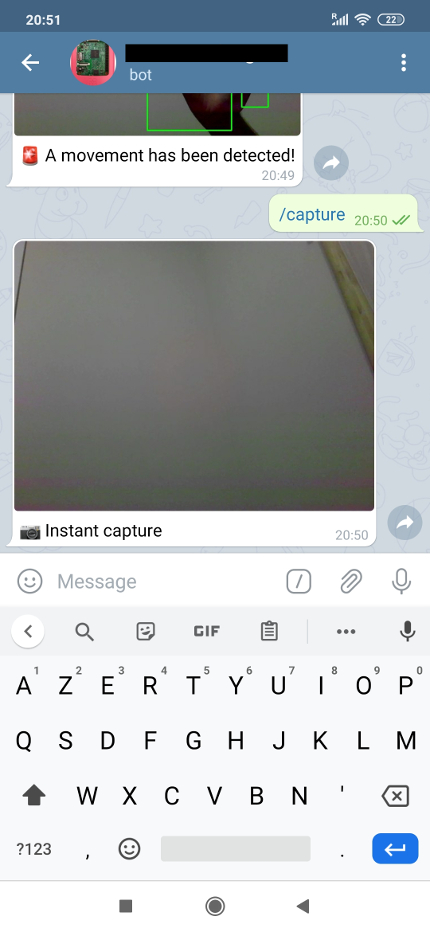

# moveTracking 
[](https://opensource.org/licenses/mit)
[](https://img.shields.io/badge/openCV-%3E%3D%204.0-green)  
A program to track movement using openCV (only CPU)  
Work fine with a [Raspberry pi](#Use-on-Raspberry-pi) (lower framerate)

<div style="text-align: center;">
    
    
</div>

## How to use
You can test with a sample video (Ex. [this site](https://www.videezy.com/free-video/car))  
The camera/video must have a fixed point to have an optimal result.
```sh
# Run with file
python3 objtrack.py -i /path/to/your/file.mp4
# Run with camera
python3 objtrack.py
# Change the display size
python3 objtrack.py --width 640 --height 480
```

## Use on Raspberry Pi
Install openCV 4 on your raspberry pi (Ex. [this tutorial](https://morioh.com/p/c1a83b6bc2d3))

```sh
git clone https://github.com/ThiBsc/myOpenCVprojects.git
cd myOpenCVprojects
workon cv
python moveTracking/src/objtrack.py -i /path/to/your/file.mp4
```

<div style="text-align: center;">
    
</div>

### Use with Telegram notification
- Follow [this tutorial](https://www.instructables.com/id/Set-up-Telegram-Bot-on-Raspberry-Pi/)
    - `pip3 install telepot`
    - Create 5 commands: `runtracking`, `stoptracking`, `status`, `capture`, `video`
- `cp src/telegram_cfg.py.dist src/telegram_cfg.py`
- In `telegram_cfg.py` set your API key in `TELEGRAM_API` and add your `user_id` in `TELEGRAM_USRID_WHITELIST`
- Just run `python3 src/telegram.py`

<div style="text-align: center;">
    
</div>